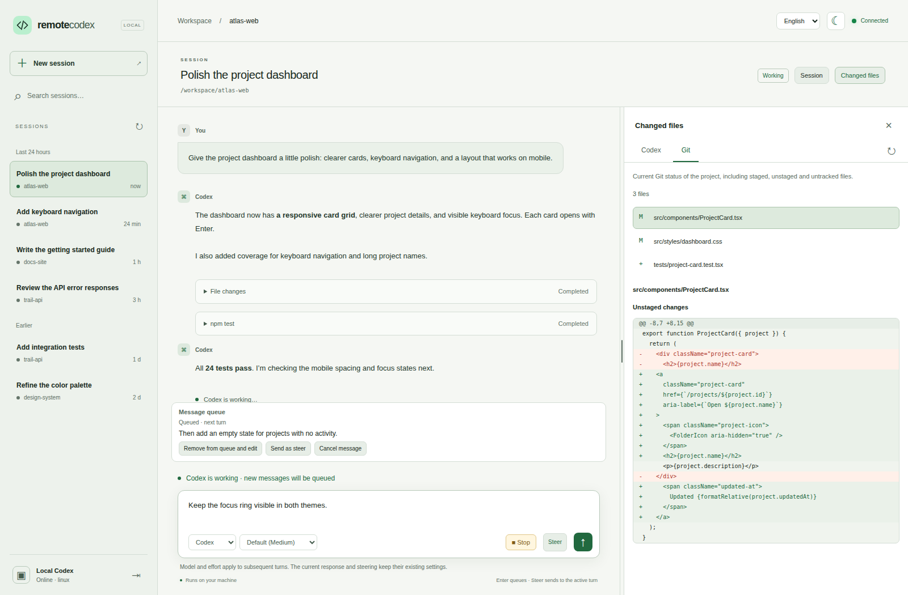
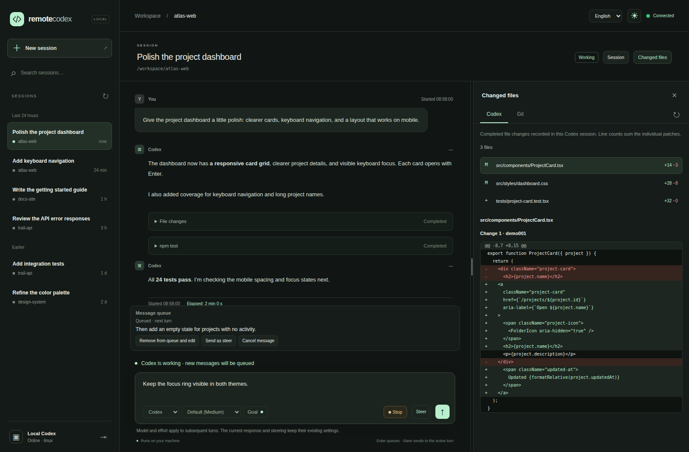
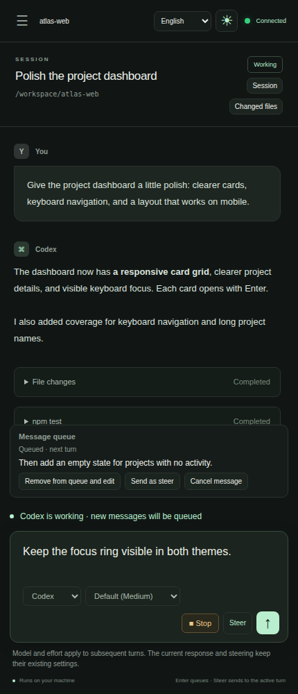

# Remote Codex

A browser interface for your existing local Codex sessions. A small Node.js server connects directly to your running Codex app-server daemon, so you can follow conversations, send instructions, handle approvals, and review changes from another computer. Codex continues working on its host machine with its existing account and configuration.

This is an independent, experimental project, not an official OpenAI product or an integration into chatgpt.com. It focuses on Codex. The [T3 Code research notes](docs/t3-code-research.md) (in Danish) explain the architecture comparison behind that choice.

The [code audit](docs/code-audit.md) records the security and correctness review, fixes, regression tests, and remaining limitations.

The [web server security review](docs/security-review-2026-09-10.md) covers authentication bypass checks, HTTP input handling, file exposure, dependency advisories, and deployment limitations.

## Screenshots

The real interface with fictional projects, conversations, and code changes. No personal session data or credentials are shown.

**Light theme — chat, queued instructions, and Git changes side by side.**



<details>
<summary>Dark theme and Codex file changes</summary>



</details>

<details>
<summary>Mobile — conversation, queue, and steering controls</summary>



</details>

## Requirements

- An updated, maintained **Node.js LTS release** and npm. The application has a technical minimum of 18.19, but new service installations require Node 22+ LTS; Node 18 and 20 are no longer maintained upstream.
- A running Codex app-server daemon with an already configured Codex account.
- Git for the Git changes tab and Git-related tests.
- A modern browser. Browser tests use Chromium through Playwright.

The integration has been tested with **Codex 0.153.4 on Linux**. It uses experimental, version-dependent app-server methods. Compatibility with other Codex versions or operating systems is not guaranteed.

## Quick start

Run these commands in the project root:

```bash
npm ci
npm start
```

There is no frontend build step. The web server listens on **0.0.0.0:4310**, covering all IPv4 network interfaces. Open **http://127.0.0.1:4310** on the host, or `http://HOST-IP:4310` from another computer. Available network addresses are printed at startup.

On first startup, the server generates an access key in `.remote-codex/access-key` with file permissions `0600` in a `0700` directory. Existing storage must belong to the service user; symlinks, hardlinked keys, and special files are rejected. Display it in a trusted local terminal and paste it into the login form:

```bash
cat .remote-codex/access-key
```

The web server connects to an existing Codex daemon; it does not start or restart Codex or create test sessions. If a daemon is not already running, start it separately:

```bash
codex app-server daemon start
```

Stop the web server with Ctrl+C. The Codex daemon and its work continue running. Keep the web server running while using the browser. `npm start` does not install a background system service.

## Background service on Linux

The setup utility generates a systemd **user service** from the [service template](deploy/remote-codex.service). It locates this checkout automatically, selects Node from your current `PATH` or `--node`, validates that runtime and the installed dependencies, and writes explicit absolute paths into the local service file.

Run setup as the same account that owns your Codex sessions, without `sudo`. Install dependencies with `npm ci` first. Preview the configuration:

```bash
npm run setup -- --dry-run

# Choose a separately installed Node instead of the first node in PATH:
npm run setup -- --node /opt/node/bin/node --dry-run
```

For a first installation, install, enable, and start the service with:

```bash
npm run setup -- --node /opt/node/bin/node --start
```

Omit `--node` to use the first `node` in `PATH`. Replace the example path with an actual, persistent installation. Setup prints the selected executable and version. It does not search caches, download Node, install npm dependencies, generate credentials, or start the Codex daemon.

The installer requires a maintained **Node LTS release, 22 or newer**. It rejects pre-LTS builds and expired release lines using a bundled lifecycle schedule; currently Node 22 and 24 are suitable lines. Use an updated patch release: validation is not an online security-advisory scan. The setup script itself can run under the application's older minimum Node version so that it can select a newer executable with `--node`. See the [Node release schedule](https://nodejs.org/en/about/previous-releases).

| Option | Behavior |
| --- | --- |
| `--node PATH` | Select the Node executable; otherwise use the first one in `PATH`. |
| `--dry-run` | Validate dependencies and show the generated unit, without writing files or invoking systemd/loginctl. |
| `--replace` | Allow replacing a different existing service file; save its previous contents in a private backup alongside it. |
| `--start` | Start the service after installation. An already running service is not restarted. |
| `--restart` | Explicitly restart after installation to apply changed runtime/settings. Browser connections and logins are interrupted. |
| `--enable-linger` | Enable this user's service manager at boot and after logout; may require administrator authorization. |
| `--help` | Show usage. |

Without `--start` or `--restart`, setup installs the unit, reloads systemd's unit configuration, and enables startup, leaving the current process untouched. Repeating setup with identical settings does not rewrite the file. To update an existing installation's Node path:

```bash
npm run setup -- --node /opt/node/bin/node --dry-run
npm run setup -- --node /opt/node/bin/node --replace

# Run when you are ready to disconnect browsers and apply the new unit:
systemctl --user restart remote-codex.service
```

The generated unit is stored under `${XDG_CONFIG_HOME:-$HOME/.config}/systemd/user/remote-codex.service`, with mode `0600`. Backups also use `0600`. Existing symlinked, hardlinked, or foreign-owned unit files are refused. If a systemd command fails, setup reports the failed step and exits nonzero; any already installed unit remains available for inspection and retry. It does not silently restart or roll back a running service. Existing systemd drop-ins remain in effect, so review them with `systemctl --user cat remote-codex.service` if they override settings.

Optional application settings belong in `.remote-codex/service.env`, with permissions `0600`. Use systemd environment-file syntax (`NAME=value`, without `export` or shell commands). The private file is ignored by Git and is loaded only by the service. Setup does not read or overwrite its contents. The Node executable is configured in the service's `ExecStart`, not in this environment file.

For boot startup before login and continued operation after logout, run setup with `--enable-linger`, or enable lingering separately:

```bash
loginctl enable-linger "$(id -un)"
```

Lingering changes the lifetime of the user's service manager, including other enabled user services. No crontab entry is needed. Stop any manually started web server using the same port before starting the service.

The manual template remains available if you prefer to install it yourself. Project paths with spaces, quotes, dollar signs and percent signs are supported. Control characters, backslashes, glob characters, and trailing whitespace in project paths are rejected; systemd also rejects quotes and backslashes in the Node executable path. Shell configuration files such as `.bashrc` are not sourced by setup or the generated service.

Manage the service with:

```bash
systemctl --user status remote-codex.service
systemctl --user restart remote-codex.service
journalctl --user -u remote-codex.service -n 50 --no-pager
```

To stop it and disable automatic startup, run `systemctl --user disable --now remote-codex.service`. Leave lingering enabled if other user services rely on it. Runtime logs go to the user journal and can include local project paths; keep them out of the public repository.

This service runs only the web server. The Codex daemon must have its own startup arrangement. The web server retries its connection if the daemon is not ready yet. Restarting the web server requires a new browser login.

## Features

- Searchable, paginated session list with project paths and activity status.
- Existing active and saved sessions through `thread/resume`, without configuration overrides.
- Conversation history, streamed responses, code blocks, Markdown tables, command output, file changes, and agent activity. Tables support column alignment and inline formatting, with horizontal scrolling on narrow screens.
- New sessions with project directory suggestions, path validation, and optional directory creation.
- Persistent Codex message queue with editing, cancellation, and conversion to a steering instruction.
- Direct steering of an active turn, and interruption of the current turn.
- One-time command and file approvals, rejection, and cancellation when Codex delivers those requests to this client.
- Responses to `item/tool/requestUserInput`, with suggestions from asynchronous questions available as message drafts.
- Separate **Codex** and **Git** changes tabs, a file list, colored diffs, and a draggable divider on desktop.
- Danish and English UI translations, light and dark themes, and green/red connection status.
- An activity indicator next to the message field, visible even when the conversation is scrolled up.
- Session commands (`/rename`, `/compact`, `/status`, `/help`) and a **Session** menu.
- Project-scoped skill discovery, inline highlighting, and explicit skill attachments with `$skill-name` or `/skill-name`.
- Model and reasoning-effort selectors in the composer, populated from the connected Codex server's model catalog.
- Automatic reconnection, history resynchronization, and restored subscriptions. Submitted actions are never replayed automatically.
- Mobile navigation and session links in the URL fragment. Drafts survive switching sessions within the same page, but not a page reload.

## Choosing a model and effort

The selectors below the message field replace the fixed model label. Their options come from the connected Codex server's `model/list` response, including that model's supported reasoning efforts. This uses the daemon's existing account and provider configuration; it does not require a separate API key or fetch a generic OpenAI model list.

Selecting a model or effort immediately updates **that session's settings for subsequent turns** through `thread/settings/update`. It does not change global Codex configuration, permissions, or another session. An active response and steering instructions retain their current turn settings; the composer shows a reminder while Codex is working. Subsequent queued turns use the updated session settings.

When switching models, the current effort is retained if the new model supports it. Otherwise the picker uses the new model's catalog default, falling back to its first supported effort if the catalog has no valid default. The effort selector only offers levels that the selected model supports. An unset effort is displayed as a default rather than silently written back to the server. A current model outside the picker catalog remains visible and is never automatically replaced.

Drafts are preserved while settings save. Sending from this browser waits for the update to finish. Live settings notifications synchronize changes made by other clients; late acknowledgements do not overwrite newer observed settings. Failed or uncertain writes are not replayed, and the picker attempts to reread the session settings. If model discovery fails, the current settings remain visible and the refresh button retries discovery. Normal messages can still use the session's existing settings.

The model catalog and available efforts are version-, provider-, and account-dependent. The bridge validates selections against the current catalog, and Codex can still reject a change due to session constraints. See the official [model catalog documentation](https://learn.chatgpt.com/docs/app-server#models).

## Choosing a project directory

The **New session** dialog suggests existing directories on the web server's host and accessible project paths from previous sessions. Enter part of an absolute path, or use `~/` for the host user's home directory. A trailing `/` lists subdirectories. Choose a suggestion with the mouse or the up/down arrow keys followed by Enter. Clear the field to see previous projects. Long lists are capped; keep typing to narrow the results.

The dialog identifies paths that exist, are missing, point to a file, or are inaccessible. An existing accessible directory can be used immediately. For a missing directory, if the web server has permission to create it, select **Create the folder when starting the session**, then **Create folder and session**. Only that explicit action creates the directory and any missing parent directories.

Directory creation does not initialize a Git repository. If Codex subsequently rejects session creation, the new directory remains in place so you can retry.

Directory lookups require authentication and read names and metadata, not file contents. For a remote Codex server, local suggestions and directory creation are disabled; enter an existing absolute path on that server instead. The project's working directory does not introduce an additional sandbox or permission boundary.

## Messages, editing, and the queue

When Codex is idle, Enter sends the message to start a turn. While Codex is working, Enter adds the message to its persistent queue; **Steer** sends an instruction to the current active turn. Shift+Enter inserts a newline.

The queue uses the experimental `thread/queue/*` methods in Codex 0.153.4. It belongs to the Codex server and is reloaded after browser refreshes and reconnections. Codex starts queued messages when the session becomes available.

- **Edit:** first removes the message from the queue, preventing it from being sent while you edit it.
- **Cancel:** removes the queued message.
- **Send as steer:** removes the message from the queue and submits its text to the active turn.
- **Send now:** starts a queued message when there is no active turn.
- **Arrow Up in an empty message field:** edits the most recent queued text message, or recalls the most recent sent text as a new draft.

Already received messages are never edited in the conversation history. Editing mode ends automatically when Codex starts a new turn or receives the submitted text. Any unsent text remains a new draft. Messages being submitted are displayed without editing controls. If delivery cannot be confirmed, no action is replayed automatically; review the queue and conversation before retrying.

Replacing an unsent draft retains its text in a recovery card. **Restore message to composer** restores it explicitly. A late send acknowledgement does not clear text typed after that submission.

Steering instructions appear immediately in the conversation with a sending indicator. After acceptance, the text stays visible until Codex records the matching message in its conversation history. This also applies when converting a queued message to a steer. Multiple pending steers remain visible across session switches and are reconciled individually, including identical text. Arrow Up can recall an accepted steer while its history event is still pending. These temporary display entries live only in the current page and are cleared by reload or logout; they do not change or replay Codex messages.

The conversation also reconciles recent stored history after turn start/completion, accepted direct submissions, and returning to the browser tab. Partial turn updates preserve already observed messages, and background reads preserve drafts. See the [message synchronization review](docs/message-synchronization.md) for the reproduced races, fixes, and recovery limits.

Drafts and text removed from the queue are kept only in the current browser page. Reloading the page discards them; messages still in Codex's queue are retained by Codex.

## Session commands and skills

Commands are recognized at the beginning of the message, after optional whitespace. They execute separately from chat and never enter the message queue. The **Session** button exposes the same actions without typing a command.

| Command | Behavior |
| --- | --- |
| `/rename New name` | Saves the session's name in Codex. `/rename` alone opens a name form. |
| `/compact` | Starts Codex context compaction. Wait until the session is idle; this never interrupts an active turn. Progress appears in the conversation. |
| `/status` | Shows the model, reasoning effort, runtime state, reported tokens, and available account rate limits. |
| `/help` | Opens the session actions and discovered skill list. |

`/compact`, `/status`, and `/help` take no arguments. Management commands mentioned in ordinary prose are plain text. Unknown commands are also plain text; `/model` is not implemented.

The composer discovers enabled skills through `skills/list`, scoped to the selected session's project directory. Type `$skill-name` or `/skill-name` anywhere in a normal message to explicitly select a discovered skill. Recognized references are highlighted in the input, and matching suggestions can be inserted by clicking or pressing Tab. Bare names remain ordinary text, allowing Codex's own implicit skill selection to work. Escaped markers, backtick code, URLs, and file paths are not treated as explicit references. Duplicate skill names are not automatically resolved.

For example, `Please /review these changes, then use $ui-polish` selects those two skills **if they are present in that project's catalog**. `/review` is a skill alias here, not an invocation of the separate native `review/start` endpoint. The slash aliases `/rename`, `/compact`, `/status`, `/help`, and `/model` are reserved for management commands; use `$name` to reference a skill with one of those names.

The bridge revalidates selected skill names against the current project catalog before forwarding a message, queue entry, or steer. It uses the server-discovered skill paths and sends native `skill` input items alongside the original text; client-supplied paths are not accepted. Queued skill attachments survive editing and conversion to steering instructions. A missing, disabled, or ambiguous selected skill produces an error rather than silently sending a message without the selected skill. Use **Session → Refresh skills** after installing a skill; `skills/changed` notifications also trigger rediscovery. If discovery is unsupported, normal text messages still work.

### Token status and its limits

Token information comes from `thread/tokenUsage/updated`, not from counting words or reconstructing the transcript. Each report replaces the previous cumulative snapshot for that thread; repeated reports are not added together. Cached input and reasoning output are displayed as breakdowns, not added again to the total.

The bridge keeps the latest reports for up to 500 threads in memory, so reopening the browser can show already-observed data. A bridge restart clears this cache. The inspected `thread/read` and `thread/resume` protocol responses do not include a token snapshot, so a session with no observed report shows **Waiting for token data** until Codex sends one. This is not an independent billing ledger, and the bridge does not scan private transcript files to fill gaps.

Disconnections, context compaction, and session settings changes mark cached figures as last-known data until a fresh usage report arrives. Status includes the report timestamp and a manual refresh button. The latest reported token count and model context window are shown separately; no exact current-context percentage is inferred, especially after compaction. Account limit percentages are the server's reported quota usage and are separate from context usage. Unavailable fields and unsupported rate-limit calls are shown explicitly.

See the official [App Server skills protocol](https://learn.chatgpt.com/docs/app-server#skills) and [event documentation](https://learn.chatgpt.com/docs/app-server#events).

## Reviewing file changes

The **Codex** tab summarizes completed `fileChange` items recorded in the selected session's history. Repeated changes are grouped by file. Added/removed line counts sum individual patches; they are not a net diff. Changes made through shell commands or other tools appear here only if Codex records them as file changes.

The **Git** tab shows the project's current staged, unstaged, and untracked changes, including edits from other sessions or manual work. It only reads Git and does not change the index or working tree. Configured clean/process filters are disabled during inspection, so filtered repositories (including Git LFS) may show different diffs from a normal filtered Git command. Parent repositories show submodule commit-pointer changes without scanning dirty submodule contents; open the submodule as its own project to inspect its working tree. Projects outside a Git repository show an explanation. This tab requires the project files to be local to the web server's host.

The panel refreshes when file changes or turns complete. Use its refresh button to pick up external Git changes. Large histories and diffs are capped and marked as truncated. A selected file displays at most 5,000 diff lines and 200,000 characters; conversation and tool items display at most 200,000 characters each. Binary untracked files and symlink contents are not opened as text.

On desktop, drag the divider between the conversation and changes panel to give diffs more room. The width is remembered in the browser and constrained to the available space. Double-click to reset it. The divider supports Tab focus, left/right arrow keys, and Home/End for the minimum/maximum width. On smaller screens, the changes panel opens over the conversation.

## Language and appearance

Use the language selector and theme button on the login screen or in the workspace header. Preferences are stored in the browser. The theme follows the operating system until you select a theme explicitly. Controls still work for the current page if browser storage is unavailable.

Fixed UI text lives in `public/locales.js`. To add a language, add its code to `languages` and provide a matching dictionary in `messages`. Conversation content, file names, and original upstream diagnostics remain unchanged.

## Access from another computer

The default binding is all IPv4 interfaces. Use `http://HOST-IP:4310` on a reachable network; authentication is required there as well. Without an explicit `REMOTE_CODEX_ORIGIN`, the server accepts localhost and its own interface IP addresses. Unexpected Host headers and cross-origin requests are rejected.

Use HTTPS for network access or a trusted SSH tunnel. Do not send the access key over an unprotected public HTTP connection. The project does not configure DNS, certificates, tunnels, VPNs, or firewall rules.

### SSH tunnel

Bind the web server to localhost:

```bash
REMOTE_CODEX_HOST=127.0.0.1 npm start
```

On the computer with your browser, open a tunnel:

```bash
ssh -N -L 4310:127.0.0.1:4310 USERNAME@CODEX-HOST
```

Then visit `http://127.0.0.1:4310` and use the same access key.

### HTTPS reverse proxy

For an HTTPS proxy on the same host:

```bash
REMOTE_CODEX_HOST=127.0.0.1 REMOTE_CODEX_ORIGIN=https://codex.example.com npm start
```

The proxy must preserve the browser's Host header, forward to `127.0.0.1:4310`, disable buffering on `/api/events`, and allow long-lived Server-Sent Events connections. The browser does not need a WebSocket connection.

## Configuration

Configuration is read from the process environment at startup. `.env` files are **not loaded automatically**. Set variables in your shell or process manager. For example:

```bash
REMOTE_CODEX_HOST=127.0.0.1 REMOTE_CODEX_PORT=4400 npm start
```

| Variable | Default / purpose |
| --- | --- |
| `REMOTE_CODEX_HOST` | `0.0.0.0`, all IPv4 interfaces. Set `127.0.0.1` for local access only. |
| `REMOTE_CODEX_PORT` | `4310`. |
| `REMOTE_CODEX_ORIGIN` | Optional exact browser origin, such as `https://codex.example.com`, without a trailing slash. Use for a custom hostname or reverse proxy. Otherwise, local interface IPs and localhost are accepted. |
| `REMOTE_CODEX_TOKEN` | Optional access key of at least 24 characters. Otherwise the locally generated key file is used. |
| `CODEX_APP_SERVER_SOCKET` | `$CODEX_HOME/app-server-control/app-server-control.sock`, or `~/.codex/app-server-control/app-server-control.sock`. |
| `CODEX_APP_SERVER_URL` | Optional existing `ws://127.0.0.1:PORT` or `wss://…` server instead of the Unix socket. Remote servers require `wss://`. |
| `CODEX_APP_SERVER_TOKEN` | Optional upstream bearer token, used only by the server. |
| `CODEX_HOME` | Optional Codex home directory used to locate the default socket. Otherwise the user's home directory plus `.codex` is used. |

Browser login uses an HttpOnly, SameSite=Strict cookie with a 12-hour lifetime. `Secure` is set when the configured origin uses HTTPS. Access keys are not stored in URLs or browser localStorage. The API validates Host, Origin, and JSON content type, rate-limits login attempts, and exposes only its implemented actions. Conversation content is inserted as DOM text rather than raw HTML. API responses and conversation data are not cached.

Restarting the web server invalidates browser logins. To rotate the access key, stop the server, remove `.remote-codex/access-key`, and restart it, or change `REMOTE_CODEX_TOKEN`. Authenticated access grants control over the sessions exposed by the connected daemon.

## Privacy and repository contents

The repository contains source code, documentation, and synthetic test fixtures. It does not require bundled API keys or account credentials. The existing Codex daemon manages the Codex account and model access. The browser access key is a separate credential for this web server.

`.gitignore` excludes:

- All of `.remote-codex/`, including `.remote-codex/access-key`.
- Environment files such as `.env` and `.env.production`, local settings, and private key material.
- Local Codex, agent, and editor configuration.
- Logs, browser traces, screenshots in test directories, and generated reports.
- Dependencies and build output.

`.env.example` and `.env.sample` files may be tracked but must contain placeholders only. Hardcoded test access keys are public, synthetic fixtures and must never be used for a real installation. Documentation examples use generic hostnames, usernames, and paths.

After login, the UI intentionally displays real project paths, conversations, tool output, and file contents. That information can be private. Ignore rules protect against accidentally committing the listed files; they do not filter Codex history or guarantee that arbitrary future files contain no sensitive information. Keep production logs and screenshots of real sessions out of source directories.

Before committing, check ignored credentials and review the selected content:

```bash
git check-ignore -v .remote-codex/access-key
git status --short
git diff --cached
```

## Project layout

```text
public/                 HTML, CSS, and browser JavaScript modules
  app.js                Session navigation, conversations, and approvals
  state.js              History and live-event reduction
  queue.js              Queued messages, editing, and resubmission
  input.js              Shared command and skill-reference recognition
  session-tools.js      Session commands, token status, and skill highlighting
  models.js             Model and reasoning-effort selection for each session
  changes.js            Changes panel, diffs, and resizing
  projects.js           Directory suggestions and new-session dialog
  locales.js            Translation dictionaries
  i18n.js               Translation helpers and language controls
  preferences.js        Theme and language applied before first paint
server/
  index.js              Startup and environment configuration
  credential-store.js         Validated local credential storage
  http.js               Browser API, static assets, authentication, and SSE
  codex.js              Connection to the existing Codex daemon
  changes.js            Codex change summaries and read-only Git operations
  projects.js           Directory lookup, validation, and explicit creation
  session-tools.js      Validated session actions, skill resolution, and token snapshots
test/                   Unit, integration, and browser tests
scripts/                Systemd service setup and reproducible screenshot capture
docs/                   Code audit, architecture research, references, and demo screenshots
```

## Architecture and protocol

```text
Browser ── HTTP(S), cookie, SSE ── Node web server
                                       │
                            JSON-RPC / WebSocket
                                       │
                            Existing Codex daemon
                              through Unix socket
```

`server/codex.js` handles initialization, RPC correlation, server requests, and reconnection. `server/http.js` defines the browser API, approval handling, and authentication. `public/state.js` combines session and turn events. The frontend uses plain JavaScript and CSS without a build step; `ws` is the only runtime dependency.

The Unix socket uses an HTTP WebSocket Upgrade handshake. `perMessageDeflate` is deliberately disabled because the tested daemon closed the connection when compression was offered. `codex app-server proxy` is a byte proxy for this transport, not a JSONL interface.

The bridge maintains one shared upstream subscription for each opened session. Multiple browser tabs see the same approval request, which can be answered only once. Responses are bound to a random token for that exact request, preventing stale approval cards from matching a reused upstream ID. Reload older browser clients after upgrading. Closing a browser does not stop Codex. Subscriptions remain in the bridge until its restart to retain live activity and pending requests.

See the official [Codex App Server documentation](https://learn.chatgpt.com/docs/app-server). Generate protocol types for an installed Codex version with:

```bash
codex app-server generate-ts --experimental --out /tmp/remote-codex-protocol
```

## Development and testing

```bash
npm run check
npm test
npx playwright install chromium
npm run test:browser
```

Integration tests use temporary local HTTP/WebSocket servers and Git repositories. Browser tests use an isolated fixture on port 4311, never real Codex sessions. They cover authentication, access control, safe rendering, history, streaming, approvals, questions, steering, interruption, drafts, reloads, and mobile navigation. They also cover translations, themes, directory suggestions and creation, Git diffs, panel resizing, queue editing/cancellation, delivery failures, and concurrent queue actions. Transport tests verify reconnection, heartbeat expiry, subscription readiness, and that actions are not automatically replayed. Audit regressions also cover stale approval tokens, Git filters, key storage, snapshot races, logout during delivery, lost drafts, retained answers, and bounded rendering.

Tests require permission to open local sockets and run browser processes. Playwright may require additional operating system packages to launch Chromium. Reports and traces are written to ignored directories.

To regenerate the README screenshots after installing Chromium, run `npm run screenshots`. The script serves the actual frontend on an ephemeral loopback port with entirely synthetic API responses, blocks external browser requests, and writes the three images to `docs/screenshots/`. It does not connect to a Codex daemon or read credentials, real sessions, or project files. Review the generated images before committing them; this directory is intentionally tracked, unlike browser test artifacts.

Use `npm run dev` to restart the web server when source files change. Browser assets are served directly from `public/`; reload the page after edits. Server restarts require a new browser login.

## Troubleshooting

| Symptom | What to check |
| --- | --- |
| Red connection indicator | Confirm that the Codex daemon is running and the configured socket or server URL points to it. Inspect the web server's terminal for errors. |
| Login rejected | Use the current access-key file or `REMOTE_CODEX_TOKEN`, if set. Repeated failures may temporarily rate-limit login. |
| Another computer cannot open the page | Check the host address, binding, firewall, and network route. `127.0.0.1` refers to the computer running the browser. |
| Host or Origin rejected | For a custom hostname, set `REMOTE_CODEX_ORIGIN` to the exact browser origin, including scheme and any port, without a trailing slash. |
| Saved sessions appear but active work is missing | Confirm that both clients use the same app-server. Saved sessions may originate from separate processes. |
| Queue unavailable | The Codex version or session may not support experimental queue methods. Steering may still work for an active turn. |
| Project path rejected | Select a directory accessible to the web server. Missing directories require explicit creation; a file cannot be used as a project directory. |
| Git tab reports no repository | The project's working directory must belong to a Git repository accessible to the web server's user. |
| An edit is missing from the Codex tab | This tab shows completed, recorded `fileChange` items. Use Git for current working-tree changes and check for truncation notices. |
| Port already in use | Stop the conflicting web server or set a different `REMOTE_CODEX_PORT`. |
| Delayed live updates through a proxy | Disable buffering for `/api/events` and allow long-lived SSE connections. |

## Scope and limitations

This client connects to the daemon you configure. A session running in a separate Codex process is not automatically the same live runtime. Saved conversations can be listed, but shared live control requires the same app-server.

Existing approval policies and reviewers remain in effect. Requests handled by automatic review or another client are not converted into browser approvals. Extended permission grants, MCP elicitation, dynamic client tools, and other unsupported server requests are referred to the original client.

Uploads, voice, an interactive terminal, and full official-app parity are not implemented. Markdown rendering supports text, links, bold text, inline code, and code blocks. There is no hosted relay, device-pairing service, automatic deployment, or automatic service installation during `npm start`. Linux user-service installation is available through `npm run setup`. `package.json` uses `private: true` to prevent accidental npm publication; this does not prevent a public GitHub repository.
